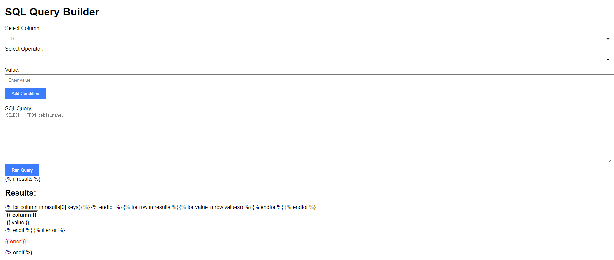

## 진행 상황
- hdfs로 파일 올림(성민님 코드 합치기 완료)
- hdfs에 올린 파일을 들고와서 입력한 query문으로 spark sql을 실행함
- 데이터를 api로 개방
- <b>(추가) flask 이용해서 웹페이지 만들고, ui조작을 통해 hive 쿼리 생성</b> 

## 실행 방법
- localhost:5000/upload에 파일 넣고 upload 버튼 누름
- 자동으로 localhost:5000/query로 이동함
- 이동 후 sql query문을 입력하고 run query 버튼을 누르면 query의 결과 테이블이 보임
 예시 화면

## 실행단계에서 오류가 발생하는 경우 확인해봐야할 것
- pyspark가 install되어 있어야함 
 -> 환경 생성할 때 pyspark도 같이 install을 해주지 않았다면 추가로 pip install pyspark를 해줘 pyspark.sql을 사용할 수 있도록 해야함
- 버전 호환의 문제
 Flask와 Werkzeug 패키지의 버전이 서로 호환되지 않아 발생하는 문제가 발생할 수 있음
 -> pip install --upgrade Flask Werkzeug 을 해주면 정상적으로 실행이 됨

 ((이것 이외로 인해 발생한 에러는 아직까지 없었습니다!))

## 추가 해야할 것
- 현재 데이터를 하나로만 진행함 -> 여러가지 데이터를 넣을 수 있게 하여 join등의 연산도 가능하게
- 같은 이름의 파일을 넣었을때 이에 대한 처리